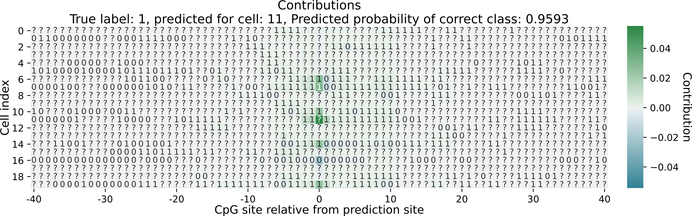

# Integrated Gradients Interpretation 



Here we provide a simple script for interpreting CpG Transformer with [Integrated Gradients](https://arxiv.org/abs/1703.01365). Requires extra packages installed:

```bash
pip install captum
pip install seaborn
```

You will need to define a simple config file specifying the which sites should be interpreted and how they should be done so. An example script is found in this folder:

```bash
cat config_file_example.txt 
chr1,5,5801,1,-1
chr2,8,9801,0,1
chr3,0,1500,0,None
chr5,11,680,0,None
```

Every row indicates one site to interpret. Columns denote the following:
1. chromosome key in the input files
2. row (cell) index of the site to be interpreted
3. column (CpG site) index of the site to be interpreted
4. Reference label of the site to be interpreted. Interpretation of every site happens against a reference label. (Contributions will be computed based on the output probability of the site being predicted as the reference label). For a binary model, should be either 0 or 1. For continuous models, should be between 0 and 1
5. Label changes at the site to be interpreted. The label at the site can be perturbed to see how the model reacts to a different label (e.g. it being unobserved/masked). For binary, should take one of these values: -1: masked, 0: unmethylated, 1: methylated, None: don't change label. For continuous models: should be -1, None, or between 0 and 1.


More info on the script arguments:

```bash
python integrated_gradients.py -h
```


**Note**: Not thoroughly tested with all model architectures that are possible with this repo. Only tested with the default architecture.